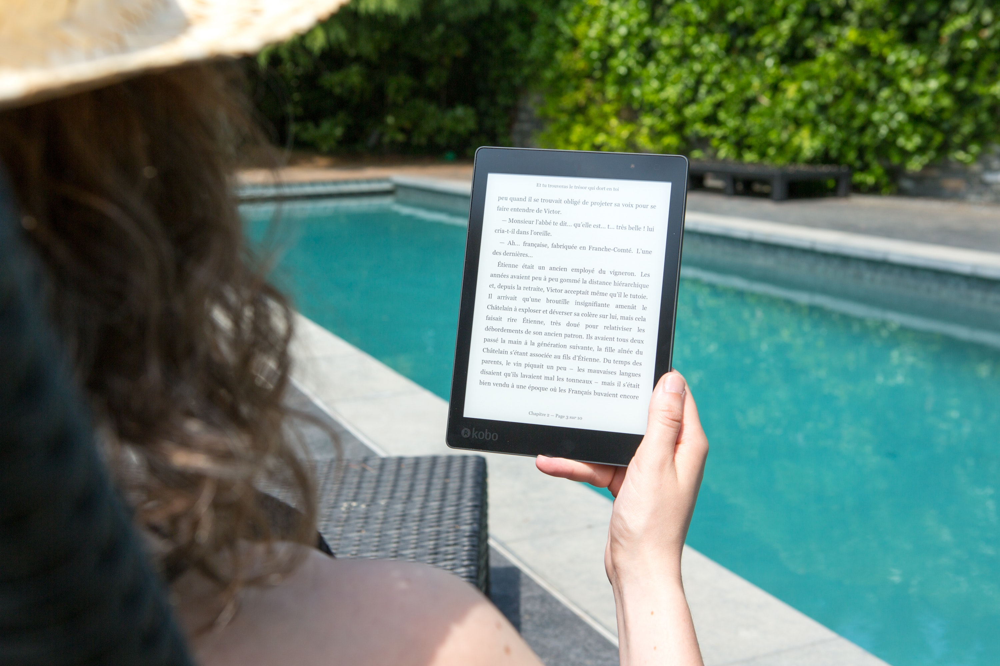

# pbook-vs-ebook3
This is the repository about argue print-book vs. e-book

##  E-Book better than Print-Book
1. One Device, Many Books:
2. Accessible Everywhere:
3. Easy on the Eyes:

_______

## Installation

No installation required

## Usage

Argument what is better a printed book or an e-book.

## Contributing

1. Fork it!
2. Create your feature branch: `git checkout -b my-new-feature`
3. Commit your changes: `git commit -am 'Add some feature'`
4. Push to the branch: `git push origin my-new-feature`
5. Submit a pull request :D

## History

October, 2023

## Credits

Dina Bondarchuk

Music

## License

MIT

hgiufkflIF